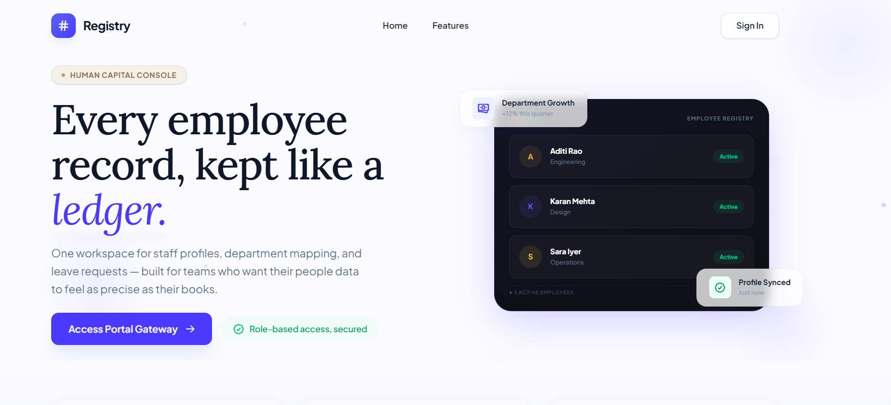
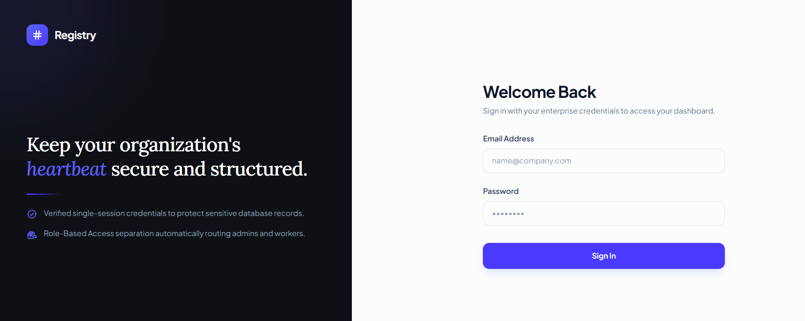
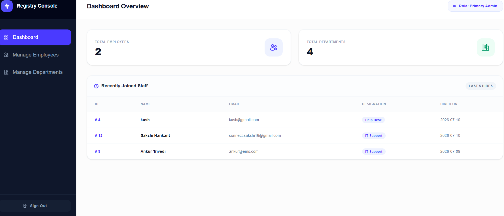

# Employee Management System

A full-stack web application for managing employee information with secure authentication and role-based access control. The system allows administrators to manage employee records while employees can access their own dashboard.

---

## Key Features

* Secure login with BCrypt password encryption
* Role-based access for Admin and Employee
* Employee management (Add, Update, Delete, View)
* Department and role management
* Search employee records

---

## Tech Stack

* **Backend:** Java 17, Spring Boot, Spring Security
* **Frontend:** Thymeleaf, HTML, CSS
* **Database:** MySQL
* **ORM:** Spring Data JPA (Hibernate)
* **Build Tool:** Maven

---
## 📸 Screenshots

### Home Page


### Login Page


### Dashboard



## How to Run

### Prerequisites

* Java JDK 17+
* MySQL
* Maven
* IntelliJ IDEA or Eclipse

### Database

```sql
CREATE DATABASE employee_management;
```

### Configure

Update the MySQL username and password in:

```text
src/main/resources/application.properties
```

### Run

1. Import the project as a Maven project.
2. Run `EmsApplication.java`.
3. Open:

```text
http://localhost:8080/login
```

---

## Default Login

| Role     | Username   | Password   |
| -------- | ---------- | ---------- |
| Admin    | `admin`    | `admin123` |
| Employee | `employee` | `user123`  |
